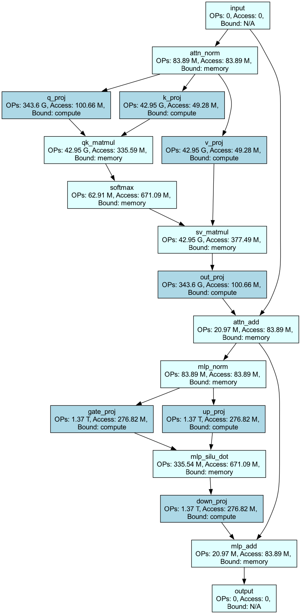
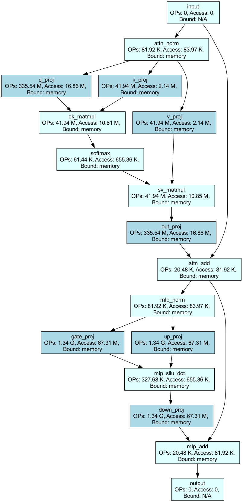

# llm_profiler
llm theoretical performance analysis tools and support params, flops, memory and latency analysis.

## 主要功能

- 支持张量并行、`pipeline` 并行推理模式。
- 支持 `A100`、`V100`、`T4` 等硬件以及主流 decoder-only 的自回归模型，可自行在配置文件中增加。
- 支持分析性能瓶颈，不同 `layer` 是 `memory bound` 还是 `compute bound`，以及 `kv_cache` 的性能瓶颈。
- 支持输出每层和整个模型的参数量、计算量，内存和 `latency`。
- 推理时支持预填充和解码阶段分别计算内存和 latency、以及理论支持的最大 `bs` 等等。
- 支持设置计算效率、内存读取效率（不同推理框架可能不一样，这个设置好后，可推测输出实际值）。
- 推理性能理论分析结果的格式化输出。

## 如何使用

使用方法，直接调用 `llm_profiler/llm_profiler.py` 文件中函数 `llm_profile()` 函数并输入相关参数即可。

```python
def llm_profile(model_name="llama-13b",
                gpu_name: str = "v100-sxm-32gb",
                bytes_per_param: int = BYTES_FP16,
                bs: int = 1,
                seq_len: int = 522,
                generate_len=1526,
                ds_zero: int = 0,
                dp_size: int = 1,
                tp_size: int = 1,
                pp_size: int = 1,
                sp_size: int = 1,
                use_kv_cache: bool = True,
                layernorm_dtype_bytes: int = BYTES_FP16,
                kv_cache_dtype_bytes: int = BYTES_FP16,
                flops_efficiency: float = FLOPS_EFFICIENCY,
                hbm_memory_efficiency: float = HBM_MEMORY_EFFICIENCY,
                intra_node_memory_efficiency=INTRA_NODE_MEMORY_EFFICIENCY,
                inter_node_memory_efficiency=INTER_NODE_MEMORY_EFFICIENCY,
                mode: str = "inference",
            ) -> dict:

    """format print dicts of the total floating-point operations, MACs, parameters and latency of a llm.

    Args:
        model_name (str, optional): model name to query the pre-defined `model_configs.json`. Defaults to "llama-13b".
        gpu_name (str, optional): gpu name to query the pre-defined `model_configs.json`. Defaults to "v100-sxm2-32gb".
        bs (int, optional): _description_. Defaults to 1.
        seq_len (int, optional): batch size per GPU.. Defaults to 522.
        generate_len (int, optional): The maximum numbers of tokens to generate, ignoring the number of tokens in the prompt. Defaults to 1526.
        ds_zero (int, optional): which DeepSpeed ZeRO stage to use.. Defaults to 0.
        dp_size (int, optional): data parallelism size. Defaults to 1.
        tp_size (int, optional): tensor parallelism size. Defaults to 1.
        pp_size (int, optional): pipeline parallelism size. Defaults to 1.
        sp_size (int, optional): sequence parallelism size. Defaults to 1.
        use_kv_cache (bool, optional): Whether or not the model should use the past last key/values attentions (if applicable to the model) to
            speed up decoding. Defaults to True.
        layernorm_dtype_bytes (int, optional): number of bytes in the data type for the layernorm activations.. Defaults to BYTES_FP16.
        kv_cache_dtype_bytes (int, optional): number of bytes in the data type for the kv_cache. Defaults to None.
        flops_efficiency (float, optional): flops efficiency, ranging from 0 to 1. Defaults to None.
        hbm_memory_efficiency (float, optional): GPU HBM memory efficiency, ranging from 0 to 1. Defaults to HBM_MEMORY_EFFICIENCY.
        intra_node_memory_efficiency (_type_, optional): intra-node memory efficiency, ranging from 0 to 1.. Defaults to INTRA_NODE_MEMORY_EFFICIENCY.
        inter_node_memory_efficiency (_type_, optional): inter-node memory efficiency, ranging from 0 to 1.. Defaults to INTER_NODE_MEMORY_EFFICIENCY.
        mode (str, optional): model training or inference. Defaults to "inference".

    Returns:
        None: format print some summary dictionary of the inference analysis
    """
```

`llama2-70` 模型，tp_size = 8 和 bs = 20，输出示例信息如下所示：

```bash
-------------------------- LLM main infer config --------------------------
{   'inference_config': {   'model_name': 'llama2-70b',
                            'bs': 20,
                            'seq_len': 1024,
                            'tp_size': 8,
                            'pp_size': 1,
                            'generate_len': 1024,
                            'use_kv_cache': True},
    'gpu_config': {   'name': 'a100-sxm-40gb',
                      'memory_GPU_in_GB': '40 GB',
                      'gpu_hbm_bandwidth': '1555 GB/s',
                      'gpu_intra_node_bandwidth': '600 GB/s',
                      'gpu_fp16_TFLOPS': '312 TFLOPS'}}

-------------------------- LLM infer performance analysis --------------------------
{   'model_params': '76.92 G',
    'model_flops': '3590.32 T',
    'prefill_first_token_latency': '1.75 s',
    'decode_per_token_latency': '15.81 ms',
    'kv_cache_latency': '900.27 us',
    'total_infer_latency': '17.94 s'}

---------------------------- LLM Params analysis ----------------------------
{   'params_mha': '150.99 M',
    'params_mlp': '805.31 M',
    'params_rmsnorm': '32.77 K'}
{'params_model': '76.92 G'}

---------------------------- LLM Flops analysis -----------------------------
{   'flops_attention_kernel': '687.7 G',
    'flops_qkvo_proj': '11.0 T',
    'flops_mlp': '32.99 T',
    'flops_rmsnorm': '2.68 G'}
{'prefill flops_model': '3590.32 T'}

---------------------------- LLM Memory analysis -----------------------------
{   'weight_memory_per_gpu': '19.23 GB',
    'prefill_act_memory_bs_1': '33.55 MB',
    'prefill_max_bs': 619,
    'prefill_act_memory_per_gpu': '671.09 MB'}
{   'weight_memory_per_gpu': '19.23 GB',
    'decode_act_memory_per_gpu': '655.36 KB',
    'kv_cache_memory_per_gpu': '1.68 GB',
    'decode_memory_total': '20.91 GB',
    'decode_max_bs': 247,
    'max_batch_total_tokens': 490680}

-------------------------- LLM Latency analysis --------------------------
{   'prefill_latency_per_layer': {   'latency_qkvo_proj': '4.89 ms',
                                     'latency_mlp': '14.68 ms',
                                     'latency_rmsnorm': '7.49 us',
                                     'latency_tp_comm': '2.17 ms'},
    'prefill_latency_qkvo_proj': '391.56 ms',
    'prefill_latency_mlp': '1.17 s',
    'prefill_latency_rmsnorm': '599.4 us',
    'prefill_latency_tp_comm': '173.99 ms',
    'prefill_latency_input_embedding': '2.76 ms',
    'prefill_latency_output_embedding': '7.46 ms',
    'prefill_latency': '1.75 s'}
{   'decode_latency_per_layer': {   'latency_qkvo_proj': '26.98 us',
                                    'latency_mlp': '143.87 us',
                                    'latency_rmsnorm': '0.01 us',
                                    'latency_tp_comm': '8.0 us'},
    'decode_latency_qkvo_proj': '2.16 ms',
    'decode_latency_mlp': '11.51 ms',
    'decode_latency_rmsnorm': '0.59 us',
    'decode_latency_tp_comm': '640.0 us',
    'decode_latency_input_embedding': '592.88 us',
    'decode_latency_output_embedding': '7.29 us',
    'kv_cache_avg_latency': '900.27 us',
    'kv_cache_peak_latency': '1.2 ms',
    'decode_avg_latency': '15.81 ms',
    'decode_peak_latency': '16.11 ms'}
```

## 模型结构可视化

llama2-70b 模型，A100-SXM40GB，tp_size = 8 和 bs = 20，prefill 阶段

<div align="center">

</div>

llama2-70b 模型，A100-SXM40GB，tp_size = 8 和 bs = 20， decode 阶段

<div align="center">

</div>

## TODO
- 支持训练模型理论性能分析
- 支持 零推理模式等理论性能分析

## 参考链接
- [Transformer 性能分析理论基础](https://github.com/HarleysZhang/dl_note/blob/main/6-llm_note/transformer_basic/Transformer%E6%80%A7%E8%83%BD%E5%88%86%E6%9E%90%E7%90%86%E8%AE%BA%E5%9F%BA%E7%A1%80.md)
- [llm_analysis](https://github.com/cli99/llm-analysis)
- [Transformer Inference Arithmetic](https://kipp.ly/blog/transformer-inference-arithmetic/)
- [LLM-Viewer](https://github.com/hahnyuan/LLM-Viewer.git)