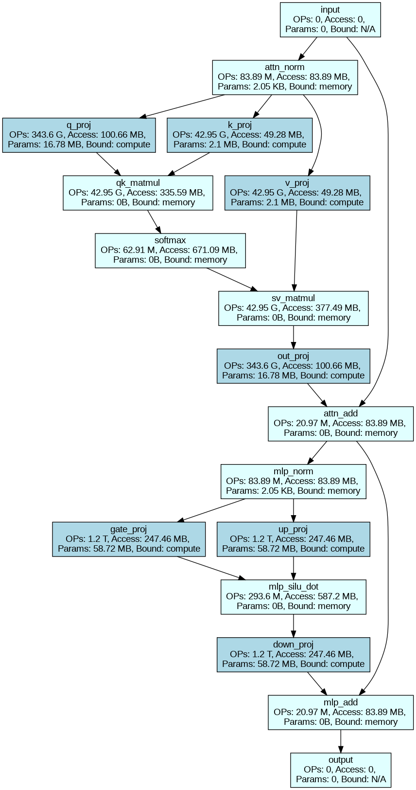
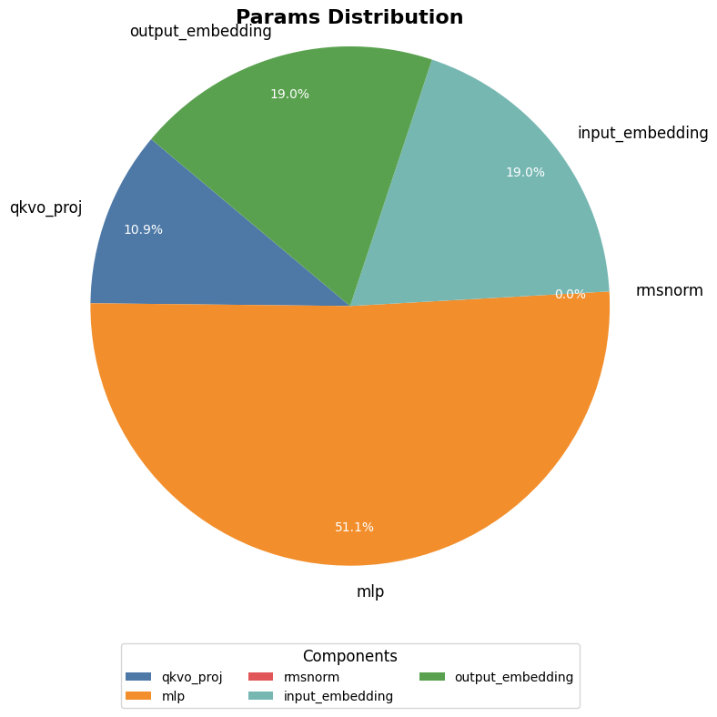
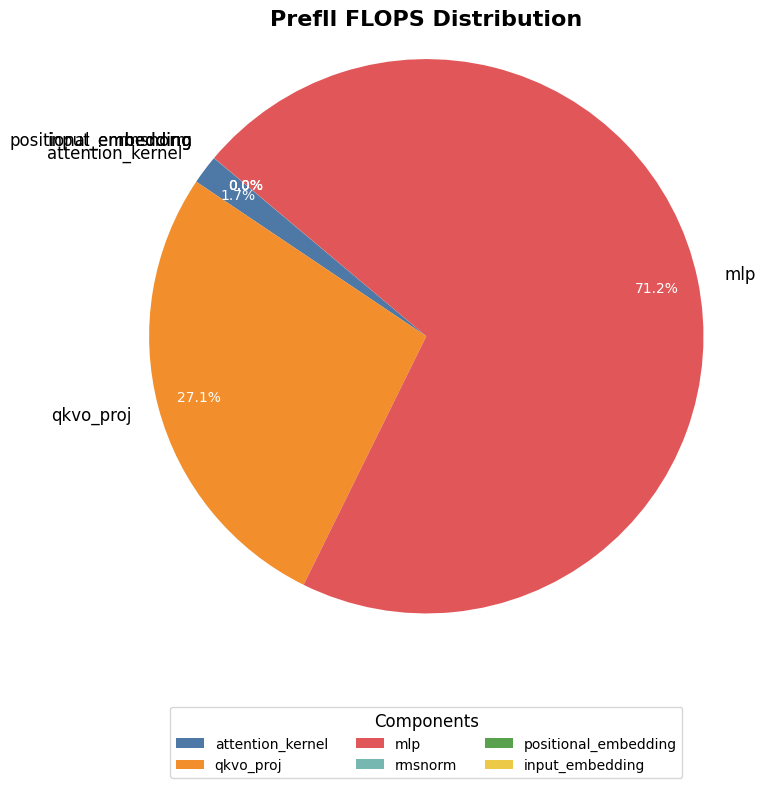
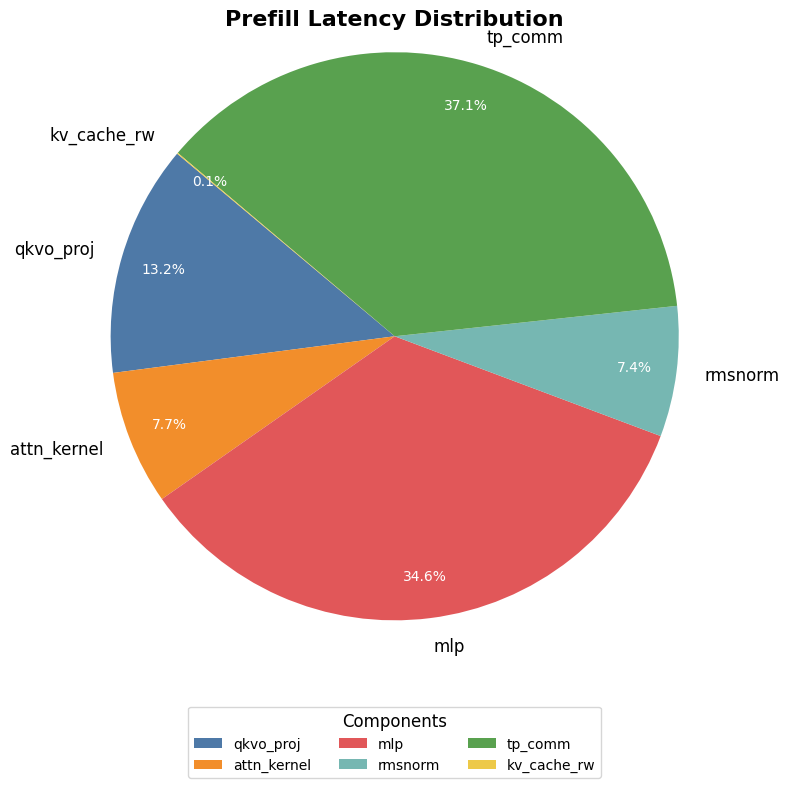
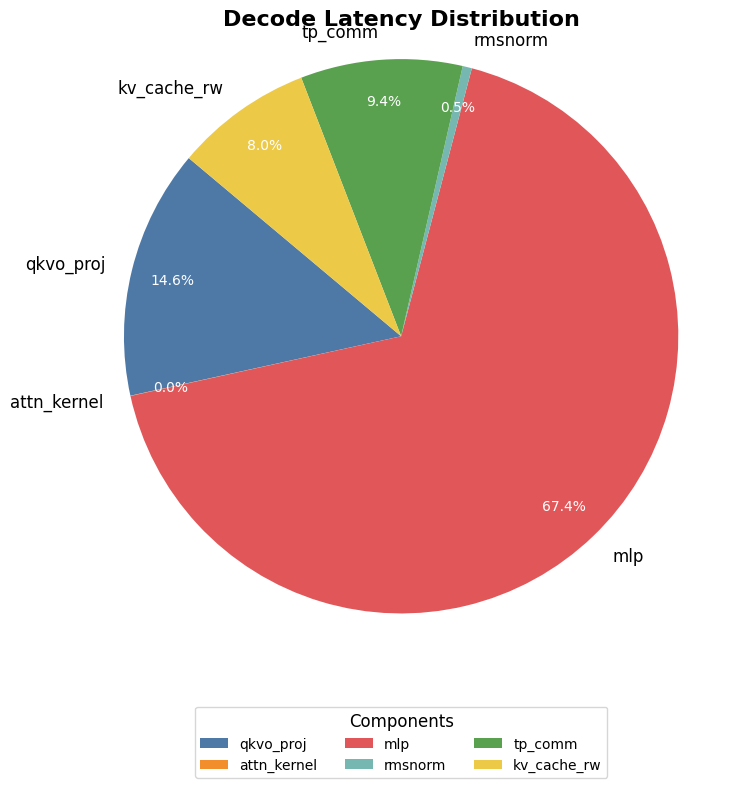

# llm_profiler

llm theoretical performance analysis tools and support params, flops, memory and latency analysis.

## 主要功能

- 支持 qwen3 dense 系列模型。
- 支持张量并行推理模式。
- 支持 `A100`、`V100`、`T4` 等硬件以及主流 decoder-only 的自回归模型，可自行在配置文件中增加。
- 支持分析性能瓶颈，不同 `layer` 是 `memory bound` 还是 `compute bound`，以及 `kv_cache` 的性能瓶颈。
- 支持输出每层和整个模型的参数量、计算量，内存和 `latency`。
- 推理时支持预填充和解码阶段分别计算内存和 latency、以及理论支持的最大 `bs` 等等。
- 支持设置计算效率、内存读取效率（不同推理框架可能不一样，这个设置好后，可推测输出实际值）。
- 推理性能理论分析结果的格式化输出。

## 如何使用

使用方法，直接调用 `llm_profiler/llm_profiler.py` 文件中函数 `llm_profile()` 函数并输入相关参数即可。

```python
def llm_profile(model_name="llama-13b",
                gpu_name: str = "v100-sxm-32gb",
                bytes_per_param: int = BYTES_FP16,
                bs: int = 1,
                seq_len: int = 522,
                generate_len=1526,
                ds_zero: int = 0,
                dp_size: int = 1,
                tp_size: int = 1,
                pp_size: int = 1,
                sp_size: int = 1,
                use_kv_cache: bool = True,
                layernorm_dtype_bytes: int = BYTES_FP16,
                kv_cache_bytes: int = BYTES_FP16,
                flops_efficiency: float = FLOPS_EFFICIENCY,
                hbm_memory_efficiency: float = HBM_MEMORY_EFFICIENCY,
                intra_node_memory_efficiency=INTRA_NODE_MEMORY_EFFICIENCY,
                inter_node_memory_efficiency=INTER_NODE_MEMORY_EFFICIENCY,
                mode: str = "inference",
            ) -> dict:

    """format print dicts of the total floating-point operations, MACs, parameters and latency of a llm.

    Args:
        model_name (str, optional): model name to query the pre-defined `model_configs.json`. Defaults to "llama-13b".
        gpu_name (str, optional): gpu name to query the pre-defined `model_configs.json`. Defaults to "v100-sxm2-32gb".
        bs (int, optional): _description_. Defaults to 1.
        seq_len (int, optional): batch size per GPU.. Defaults to 522.
        generate_len (int, optional): The maximum numbers of tokens to generate, ignoring the number of tokens in the prompt. Defaults to 1526.
        dp_size (int, optional): data parallelism size. Defaults to 1.
        tp_size (int, optional): tensor parallelism size. Defaults to 1.
        pp_size (int, optional): pipeline parallelism size. Defaults to 1.
        sp_size (int, optional): sequence parallelism size. Defaults to 1.
        use_kv_cache (bool, optional): Whether or not the model should use the past last key/values attentions (if applicable to the model) to
            speed up decoding. Defaults to True.
        layernorm_dtype_bytes (int, optional): number of bytes in the data type for the layernorm activations.. Defaults to BYTES_FP16.
        kv_cache_bytes (int, optional): number of bytes in the data type for the kv_cache. Defaults to None.
        flops_efficiency (float, optional): flops efficiency, ranging from 0 to 1. Defaults to None.
        hbm_memory_efficiency (float, optional): GPU HBM memory efficiency, ranging from 0 to 1. Defaults to HBM_MEMORY_EFFICIENCY.
        intra_node_memory_efficiency (_type_, optional): intra-node memory efficiency, ranging from 0 to 1.. Defaults to INTRA_NODE_MEMORY_EFFICIENCY.
        inter_node_memory_efficiency (_type_, optional): inter-node memory efficiency, ranging from 0 to 1.. Defaults to INTER_NODE_MEMORY_EFFICIENCY.

    Returns:
        None: format print some summary dictionary of the inference analysis
    """
```

`llama2-70` 模型，tp_size = 8 和 bs = 20，输出示例信息如下所示：

```bash
-------------------------- LLM main infer config --------------------------
{   'inference_config': {   'model_name': 'Qwen3-32B',
                            'bs': 32,
                            'seq_len': 128,
                            'tp_size': 4,
                            'pp_size': 1,
                            'generate_len': 2048,
                            'use_kv_cache': True},
    'gpu_config': {   'name': 'a100-sxm-80gb',
                      'memory_GPU_in_GB': '80 GB',
                      'gpu_hbm_bandwidth': '2039 GB/s',
                      'gpu_intra_node_bandwidth': '600 GB/s',
                      'gpu_fp16_TFLOPS': '312 TFLOPS'}}

-------------------------- LLM infer performance analysis --------------------------
{   'weight_memory_per_gpu': '15.99 GB',
    'consume_memory_per_gpu': '18.85 GB',
    'prefill_flops': '261.84 T',
    'decode_flops_per_step': '2.04 T',
    'prefill_first_token_latency': '267.68 ms',
    'decode_per_token_latency': '11.57 ms',
    'kv_cache_latency': '91.42 us',
    'total_infer_latency': '23.96 s',
    'support_max_batch_total_tokens': 1513386}

---------------------------- LLM Params per_layer analysis ----------------------------
{   'qkvo_proj': '94.37 M',
    'mlp': '393.22 M',
    'rmsnorm': '10.5 K',
    'input_embedding': '777.91 M',
    'output_embedding': '777.91 M'}
{'params_model': '31.98 G'}

---------------------------- LLM Prefill Flops per_layer analysis -----------------------------
{   'attention_kernel': '10.8 G',
    'qkvo_proj': '858.99 G',
    'mlp': '3.22 T',
    'rmsnorm': '335.54 M',
    'positional_embedding': '41.94 M',
    'input_embedding': '0'}
{'prefill flops_model': '261.84 T'}

---------------------------- LLM Memory analysis -----------------------------
{   'weight_memory_per_gpu': '15.99 GB',
    'prefill_max_bs': 9766,
    'prefill_act_memory_per_gpu': '209.72 MB'}
{   'decode_act_memory_per_gpu': '1.64 MB',
    'kv_cache_memory_per_gpu': '2.85 GB',
    'consume_memory_per_gpu': '18.85 GB',
    'decode_max_bs': 717,
    'max_batch_total_tokens': 1513386}

-------------------------- LLM Latency analysis --------------------------
{   'prefill_qkvo_proj': '48.95 ms',
    'prefill_attn_kernel': '2.73 ms',
    'prefill_mlp': '183.55 ms',
    'prefill_rmsnorm': '5.85 ms',
    'prefill_tp_comm': '22.37 ms',
    'prefill_kv_cache_rw': '91.42 us',
    'prefill_latency': '267.68 ms'}
{   'decode_qkvo_proj': '1.67 ms',
    'decode_attn_kernel': '3.19 us',
    'decode_mlp': '6.89 ms',
    'decode_rmsnorm': '47.89 us',
    'decode_tp_comm': '512.0 us',
    'decode_kv_cache_rw': '1.55 ms',
    'kv_cache_latency': '91.42 us',
    'decode_latency': '11.57 ms'}
```

## 模型结构可视化

llama2-70b 模型，A100-SXM40GB，tp_size = 8 和 bs = 20，prefill 阶段:

<div align="center">

</div>

llama2-70b 模型，A100-SXM40GB，tp_size = 8 和 bs = 20， decode 阶段:

<div align="center">

</div>

## 模型参数量、计算量、latency 分布

llama2-70b 模型，A100-SXM40GB，tp_size = 8 和 bs = 20，参数量统计分布:

<div align="center">

</div>

llama2-70b 模型，A100-SXM40GB，tp_size = 8 和 bs = 20，prefill 阶段计算量统计分布:

<div align="center">

</div>

llama2-70b 模型，A100-SXM40GB，tp_size = 8 和 bs = 20，prefill 阶段 latency 统计分布:

<div align="center">

</div>

llama2-70b 模型，A100-SXM40GB，tp_size = 8 和 bs = 20，decode 阶段 latency 统计分布:

<div align="center">

</div>

## 参考链接
- [Transformer 性能分析理论基础](https://github.com/HarleysZhang/dl_note/blob/main/6-llm_note/transformer_basic/Transformer%E6%80%A7%E8%83%BD%E5%88%86%E6%9E%90%E7%90%86%E8%AE%BA%E5%9F%BA%E7%A1%80.md)
- [llm_analysis](https://github.com/cli99/llm-analysis)
- [Transformer Inference Arithmetic](https://kipp.ly/blog/transformer-inference-arithmetic/)
- [LLM-Viewer](https://github.com/hahnyuan/LLM-Viewer.git)